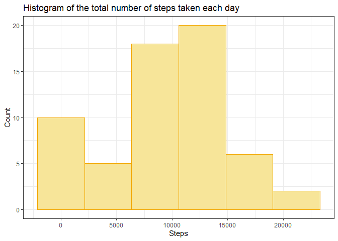
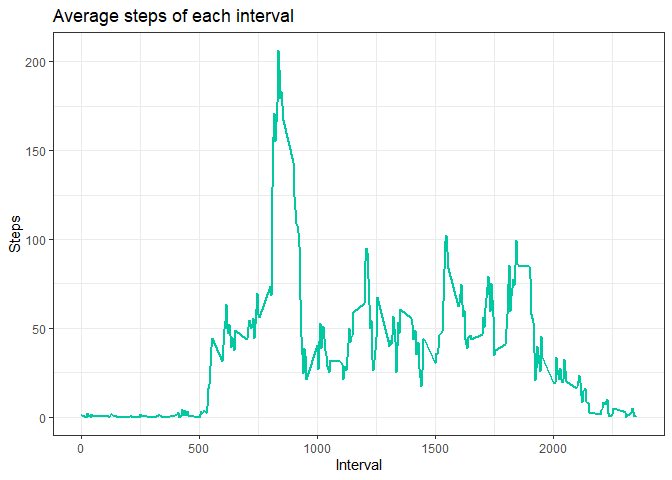
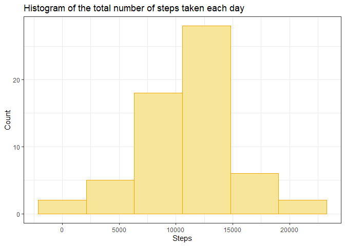
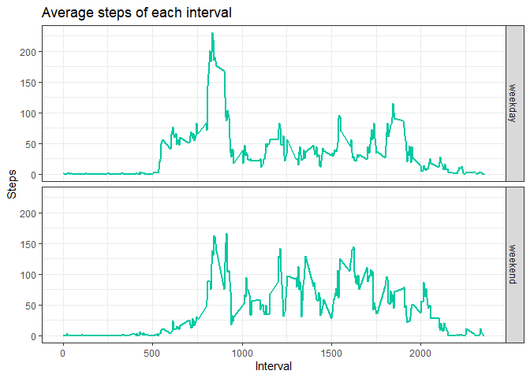

#### Load library


```r
library(tidyverse)
```

## Loading and preprocessing the data


```r
if(!dir.exists('data')) {
    dir.create('data')
    unzip('activity.zip', exdir = 'data')
}
data <- read_csv('data/activity.csv')
data
```

```
## # A tibble: 17,568 x 3
##    steps date       interval
##    <dbl> <date>        <dbl>
##  1    NA 2012-10-01        0
##  2    NA 2012-10-01        5
##  3    NA 2012-10-01       10
##  4    NA 2012-10-01       15
##  5    NA 2012-10-01       20
##  6    NA 2012-10-01       25
##  7    NA 2012-10-01       30
##  8    NA 2012-10-01       35
##  9    NA 2012-10-01       40
## 10    NA 2012-10-01       45
## # ... with 17,558 more rows
```
## What is mean total number of steps taken per day?
Calculate the total number of steps taken per day

```r
steps_per_day <- data %>%
    group_by(date) %>%
    summarize(steps = sum(steps, na.rm = TRUE))
steps_per_day
```

```
## # A tibble: 61 x 2
##    date       steps
##    <date>     <dbl>
##  1 2012-10-01     0
##  2 2012-10-02   126
##  3 2012-10-03 11352
##  4 2012-10-04 12116
##  5 2012-10-05 13294
##  6 2012-10-06 15420
##  7 2012-10-07 11015
##  8 2012-10-08     0
##  9 2012-10-09 12811
## 10 2012-10-10  9900
## # ... with 51 more rows
```
Make histogram of the total number of steps taken each day.

```r
steps_per_day %>% ggplot(aes(steps)) +
    geom_histogram(bins = 6, fill = '#f7e599', color = '#f2a600') +
    labs(title = 'Histogram of the total number of steps taken each day',
         x = 'Steps',
         y = 'Count') +
    theme_bw()
```

<!-- -->

Mean and median number of steps

```r
mean(steps_per_day$steps)
```

```
## [1] 9354.23
```

```r
median(steps_per_day$steps)
```

```
## [1] 10395
```

## What is the average daily activity pattern?
Calculate average number of steps for each interval

```r
mean_steps_interval <- data %>%
    group_by(interval) %>%
    summarize(steps = mean(steps, na.rm = TRUE))
```
Make a time series plot of the 5 minutes interval and the avegare of steps taken.

```r
mean_steps_interval %>%
    ggplot(aes(interval, steps)) +
    geom_line(lwd = 1, color = '#00c9a1') +
    labs(title = 'Average steps of each interval',
         x = 'Interval',
         y = 'Steps') +
    theme_bw()
```

<!-- -->

Interval contains the maximum number of steps

```r
m <- which.max(mean_steps_interval$steps)
mean_steps_interval[m,]
```

```
## # A tibble: 1 x 2
##   interval steps
##      <dbl> <dbl>
## 1      835  206.
```

## Imputing missing values
Calculate total number of missing values

```r
sum(is.na(data$steps))
```

```
## [1] 2304
```
Replace missing values with the mean for 5-minutes interval

```r
new_data <- data %>%
    group_by(interval) %>%
    mutate(steps = if_else(is.na(steps), mean(steps, na.rm = TRUE), steps)) %>%
    ungroup()
```
Calculate the total number of steps taken per day with `new_data`

```r
new_steps_per_day <- new_data %>%
    group_by(date) %>%
    summarize(steps = sum(steps, na.rm = TRUE))
new_steps_per_day
```

```
## # A tibble: 61 x 2
##    date        steps
##    <date>      <dbl>
##  1 2012-10-01 10766.
##  2 2012-10-02   126 
##  3 2012-10-03 11352 
##  4 2012-10-04 12116 
##  5 2012-10-05 13294 
##  6 2012-10-06 15420 
##  7 2012-10-07 11015 
##  8 2012-10-08 10766.
##  9 2012-10-09 12811 
## 10 2012-10-10  9900 
## # ... with 51 more rows
```
Make histogram of the total number of steps taken each day with `new_data`

```r
new_steps_per_day %>% ggplot(aes(steps)) +
    geom_histogram(bins = 6, fill = '#f7e599', color = '#f2a600') +
    labs(title = 'Histogram of the total number of steps taken each day',
         x = 'Steps',
         y = 'Count') +
    theme_bw()
```

<!-- -->

Mean and median number of steps with `new_data`

```r
summary(new_steps_per_day$steps)
```

```
##    Min. 1st Qu.  Median    Mean 3rd Qu.    Max. 
##      41    9819   10766   10766   12811   21194
```
Imputing missing data increase mean and median number of steps per day

```r
summary(steps_per_day$steps)
```

```
##    Min. 1st Qu.  Median    Mean 3rd Qu.    Max. 
##       0    6778   10395    9354   12811   21194
```
## Are there differences in activity patterns between weekdays and weekends?
Create `weekd` variables in dataset with two levels 'weekday' and 'weekend'

```r
new_data <- new_data %>%
    mutate(weekd = factor(
        if_else(weekdays(date, abbreviate=TRUE) %in% c('Sat','Sun'), 'weekend', 'weekday')
    ))
```
Calculate the average number of steps for each 5-minute interval on weekdays or weekends, make time series plot.

```r
new_data %>%
    group_by(interval, weekd) %>%
    summarize(steps = mean(steps)) %>%
    ggplot(aes(interval, steps)) +
        geom_line(lwd = 1, color = '#00c9a1') +
        labs(title = 'Average steps of each interval',
         x = 'Interval',
         y = 'Steps') +
        facet_grid(weekd~.) +
        theme_bw()
```

<!-- -->
